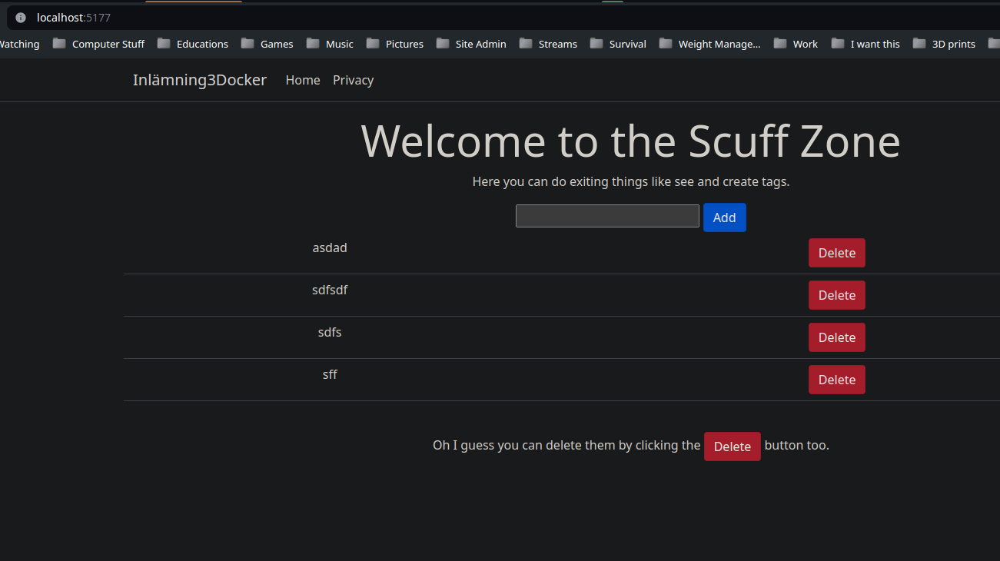

# Inlämningsuppgift 3
### Index
1. [Introduktion](#introduktion)
2. [Verktyg](#verktyg)
3. [Uppgift 1](#uppgift-1)
4. [Uppgift 2](#uppgift-2)
    1. [Uppdatering av appen](#uppdatering-av-appen)
    2. [Implementation av Compose](#implementation-av-compose)
    3. [Provisionering](#provisionering)
5. [Sammanfattning](#sammanfattning)
6. [Kod](#kod)
7. [Referenser](#referenser)

### Verktyg
- VSCode
- Azure Cloud tjänster
- Github
- Docker
- .NET 8.0

## Introduktion
Så denna veckan har vi en dubbeldelad uppgift, först att vi bara ska skapa en docker image som vi laddar upp och kan köra via en VM på Azure. Antagligen då för att vi ska kunna visa att vi har uppdaterat en image och att vi ska kunna ta det från docker hub automatiskt.  

Andra delen är mest för att se ifall vi kan implementera docker compose med flera olika containrar och ifall vi kan hantera data som inte ligger i en container via docker volume.
## Uppgift 1
Körde dessa kommandon för att komma igång väldigt snabbt, 
```bash
dotnet new webapp                   # Skapar ny webapp via dotnet
dotnet new gitignore                # Skapar en gitignore for dotnet appar
docker init                         # Skapar Dockerfile.
docker build -t gatreh/uppgift3 .   # Bygger docker image
git init
git add .
git commit -m "Initial commit"      # Dessa tre lägger up basic git repo

# Testar så img fungerar
docker run -d -p 80:8080 --name app gatreh/uppgift3  # Kör image
docker push gatreh/uppgift3         # Skickar imgage till docker hub
```
Med det ur vägen så ändrar jag lite på tidigare [provisionerings script](#provision_vmsh) och [cloud-init script](#cloud-init_dockeryaml)för att anpassass till vårat nuvarande projekt och SSH'ar till  VM'en för att se så det går igenom och startas. När jag ser det startat surfar jag till hemsidan för att se så det går att nå den utifrån också sen tar jag bort den virtuella maskinen.

## Uppgift 2
### Uppdatering av appen
Det första som måste hända nu när det fungerar på via VM'en är att få igång någon form av interaktion mellan appen och databasen. Ser ingen igentlig anledning till att vi inte skulle göra något väldigt likt vad vi gjort tidigare så jag tar hjälp av tidigare uppgifter för att hämta data från sidan och skicka direkt in det till en mongodb container.

### Implementation av Compose
Jag la in en databas som jag kallar mongodb-data, en mongocontainer som jag kallar db och jag startar appen med min image och lite environment variables i [compose.yaml](#composeyaml).  

Detta kombinerade jag sen med en write_files i min cloud-init .yaml fil. för att få över den till den virtuella maskinen... då jag är för lat för att lägga upp en CICD pipeline 1 timme 20 min innan inlämningen ska hända Xd
## Sammanfattning
Rätt kul uppgifter ändå, ganska standard för vad vi har gjort visseligen i kursen, lekte lite med min norska kompis när den faktiskt va uppe på den virtuella maskinen som du seri bilden nedan. Loggade in på servern för att se till att compose filen faktiskt följde med och testa starta och stänga ner saker med docker compose fungerar. Och att se till så datan klarar sig förstås.  


Tror ändå mitt favoritkommando denna gången var:
```bash
ssh azureuser@$(az vm show -d -g docker3 -n docker3 --query publicIps -o tsv)
```
Men lärde mig även hur man tar bort resursgrupper via CLI och mycketmer om .yaml.  

En liten märklig sak är att trots att nätverket aldrig säger att det startas så fungerar det ändå på servern:

## Kod
#### provision_vm.sh
```bash
#!/bin/bash

resource_group=docker3
location=northeurope
vm_name=docker3
vm_port=80

az group create --location $location --name $resource_group

az vm create --name $vm_name --resource-group $resource_group \
             --image Ubuntu2204 --size Standard_B1s \
             --generate-ssh-keys --admin-username azureuser \
             --custom-data @cloud-init_docker.yaml

az vm open-port --port $vm_port --resource-group $resource_group --name $vm_name
```
#### cloud-init_docker.yaml
```yaml
#cloud-config

# Update system
package_update: true

# Install Docker Engine
runcmd:
# Add Docker's official GPG key
- apt-get install ca-certificates curl -y
- install -m 0755 -d /etc/apt/keyrings
- curl -fsSL https://download.docker.com/linux/ubuntu/gpg -o /etc/apt/keyrings/docker.asc
- chmod a+r /etc/apt/keyrings/docker.asc

# Add the repository to Apt sources
- echo "deb [arch=$(dpkg --print-architecture) signed-by=/etc/apt/keyrings/docker.asc] https://download.docker.com/linux/ubuntu $(. /etc/os-release && echo "$VERSION_CODENAME") stable" | tee /etc/apt/sources.list.d/docker.list > /dev/null

# Install Docker
- apt-get update -y
- apt-get install docker-ce docker-ce-cli containerd.io docker-buildx-plugin docker-compose-plugin -y
- docker run -d -p 80:8080 --name app gatreh/uppgift3
```
#### compose.yaml
```yaml
services:
  # MongoDB Service
  db:
    image: mongo
    restart: always
    volumes:
      - mongodb-data:/data/db
  # App Service
  app:
    image: gatreh/uppgift3
    restart: always
    ports:
      - 80:8080
    environment:
      - MongoDbSettings__ConnectionString=mongodb://db:27017
      - TODO_SERVICE_IMPLEMENTATION=MongoDb
      - ASPNETCORE_ENVIRONMENT=Development
# Volumes
volumes:
  mongodb-data:
```
## Referenser
- [Microsoft Linux VM](https://learn.microsoft.com/en-us/azure/virtual-machines/linux/tutorial-automate-vm-deployment)  
Väldigt användbart för att veta hur man ska formatera cloud-init filerna så dem faktiskt skapar saker.
- [Skolans Todo app](https://github.com/Campus-Molndal/ToDoApp)  
Tillät mig inspireras ganska starkt av den men jag gjorde vad jag kunde för att göra den på ett så eget sätt som möjligt.